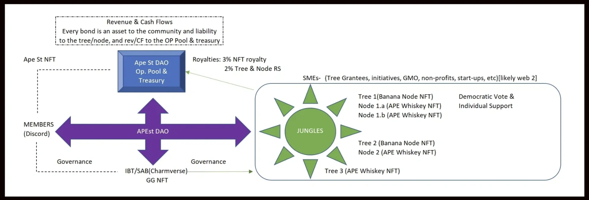

# APE St DAO/Marketplace

Ape St DAO seeds ventures via a social impact NFT ecosystem.
## Description of Project & Whitepaper
### https://www.apestdao.com

# ToDos
### BE connected to Eth
### FE
### NFT creation
### CC???
### Mobile Application

______________

## Technologies Used:
### Solidity - SMART CONTRACTS
### HardHat - FrameWork
### ReMix - IDE
### Python - Scripts[BE]
### JS & CSS [FE]
### React/React App
### IPFS - File storage
### Ethers JS
### Ganache
### Metamask Wallet???
### LoopRing Wallet(Layer 2)
### LoopRing Minter
### Alchemy Minter
### Payment Gateway
### Encrypted Private Key Storage
### Transaction Auth
### API Integration
### Authorization
### CRUD

# APE St DAO routes : Users(Apes), Jungles, Trees, Nodes, NFTs
| ENDPOINT         | METHOD        | PURPOSE |
|------------------|-------------|---------|
|/home             |  GET        | home page |
|/user/Sign-up    |  POST       | User Sign-up page  |
|/user/Login     |  POST       | User Login page  |
|/apes       |  GET        | Display all users  |
|/NFT/new      |  POST       | Creates a new NFT smart contract  |
|/NFT/:id      |  GET       | Displays a NFT smart contract  |
|/NFT/:id      |  Edit       | Edit a NFT smart contract  |
|/NFT/:id      |  PUT        | Updates NFT smart contract  |
|/NFT/:id      |  DELETE     | Destroys NFT smart contract  |
|/jungle/:id          |  GET        | Display a Jungle  |
|/jungle/trees          |  GET        | Display all trees in a jungle  |
|/tree/:id          |  GET        | Display a specific tree  |
|/tree/:id/nodes          |  GET        | Display all nodes of a specific tree|
|/node/:id          |  GET        | Display a specific node|
||| More Research to do on routing and transactions!!!

# Miro Board
https://miro.com/app/board/uXjVNf75VQ8=/?share_link_id=104831078084

### User Authentication
Implement user authentication for both schools and security personnel. 

### Database Models
Define database models for APES, Projects, and Transactions.

### Matching Algorithm

### Payment Processing

### Admin Dashboard

## Frontend (React):

### User Registration and Profiles

### Search and Filter

### Chat and Notifications

### Booking and Scheduling

### Reviews and Ratings

### Payment Integration

### Responsive Design

### Security
Implement security measures to protect user data and ensure secure transactions.

### User Support
Provide a support system for users to seek assistance and resolve issues.

### Feedback and Improvement
Collect feedback from users to continuously improve the platform's features and usability.

# Pipeline for long term viability planning

## Project Scope and Planning:

### Clearly define the scope and objectives of PSS. What specific services will you offer, and how will it work?
Develop a detailed project plan that includes milestones, timelines, and resource allocation.

### Market Research:

### Conduct thorough market research to understand the demand for security services in the education sector.
Identify potential competitors and their offerings.

### Legal and Regulatory Compliance:

### Ensure that your platform complies with all relevant laws and regulations related to security services, privacy, and data protection.
User Authentication and Authorization:

### Implement a robust user authentication system to verify the identity of both security personnel and schools.
Set up authorization rules to control access to different parts of the platform.

## Database Design:

Design a database schema to store information

### Matching Algorithm:

### Develop a matching algorithm that pairs security personnel with suitable job assignments based on criteria such as location, qualifications, and availability.
Payment Processing:

### Integrate a secure payment gateway to handle transactions between schools and security personnel.
Implement a billing and invoicing system.
User Interface (UI):

### Design an intuitive and user-friendly interface for both security personnel and schools.
Implement responsive web design to ensure accessibility on various devices.
Real-Time Communication:

### Integrate real-time chat and notification features to facilitate communication between users.
Reviews and Ratings:

### Implement strong security measures to protect user data, including encryption, secure authentication, and regular security audits.

# Customer Support:

# Marketing and Promotion:

### Thoroughly test the platform to identify and fix bugs and issues.
Perform user acceptance testing (UAT) to ensure it meets user expectations.
Scalability:

### Build the platform with scalability in mind to handle an increasing number of users and security assignments.

# Data Analytics:

### Implement analytics tools to gather insights into user behavior, which can help improve the platform's performance and user experience.

# Documentation:

# Monitoring and Maintenance:

### Set up monitoring tools to ensure the platform's uptime and performance.
Provide regular maintenance and updates to enhance security and functionality.